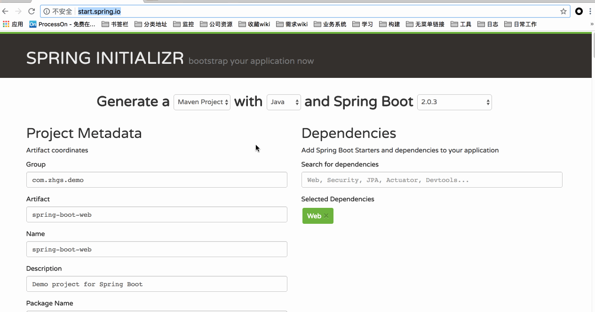
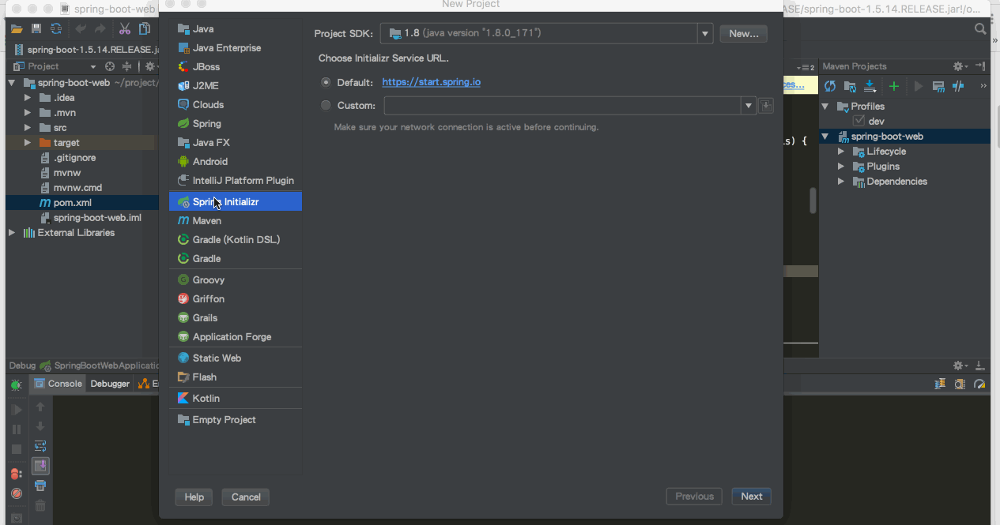
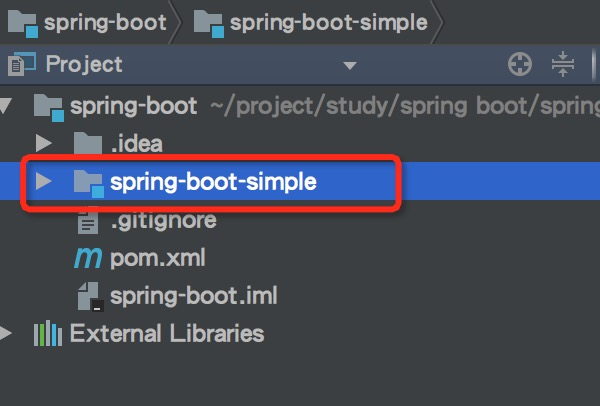

## spring boot介绍
### 依赖(学习前需要了解清楚)
* By default, Spring Boot 1.5.15.BUILD-SNAPSHOT requires Java 7 and Spring Framework 4.3.18.RELEASE or above. You can use Spring Boot with Java 6 with some additional configuration. See Section 85.11, [“How to use Java 6”](https://docs.spring.io/spring-boot/docs/1.5.15.BUILD-SNAPSHOT/reference/htmlsingle/#howto-use-java-6) for more details. Explicit build support is provided for Maven (3.2+), and Gradle 2 (2.9 or later) and 3.  我使用idea创建项目只能选2.0版本，建议springboot 2+ jdk1.8

### what is spring boot?（what)
java发展至今，经久不衰，我觉得spring和android起了很大的作用，spring framework经历了十几年的发展，大家都经历过繁琐的xml配置，spring设计中有个理念“约定大于配置",spring boot诞生了，基于这个理念，让java开发人员不再需要定义样板化的配置，就像maven库存一样整合了所有的jar包，spring boot汇总并简化了所有架构。简单来说：使用spring不再需要繁琐的配置了。

### 使用spring boot有什么好处?（Why）
其实就是简单、快速、方便！平时我们需要搭建一个spring web项目的时候需要怎么做？

* 配置web.xml，集成加载spring各模块
* 配置数据库连接、事务
* 配置加载配置文件的类、开启注解
* 配置日志文件
* 部署tomcat
等等一系列操作

现在非常流行微服务，如果我这个项目仅仅只是需要发送一个邮件，如果我的项目仅仅是生产一个积分；我都需要这样折腾一遍!

但是如果使用spring boot呢？
很简单，我仅仅只需要非常少的几个配置就可以迅速方便的搭建起来一套web项目或者是构建一个微服务！

## 快速入门(How)
一起来动手试试吧

### 新建项目
新建项目有两种方式

* [springboot官网](http://start.spring.io/) 勾选参数自动生成工程，如下图

	

* idea新建springboot项目

	

spring boot自带tomcat容器的端口默认是8080，可以自行修改，关键配置为server.port=8081，也可用环境变量-Dserver.port=8081 原理参考[https://blog.csdn.net/zknxx/article/details/53433592](https://blog.csdn.net/zknxx/article/details/53433592)

新增工程前建议先建一个普通的maven POM工程来管理后续的demo工程
我的工程目录如下：

### 新建一个Controller
代码如下

	package org.zhgs.demo.springboot.controller;

	import org.springframework.web.bind.annotation.RequestMapping;
	import org.springframework.web.bind.annotation.RestController;
	
	@RestController
	public class HelloWordController {
	
	    @RequestMapping("/hello")
	    public String index(){
	        return "hello spring boot!";
	    }
	}

在新建项目后生成的xxxxApplication类中有main方法，在idea中右击-run，运行前可以在server中编辑vm options 修改`-Dserver.port=8081` 默认为8080; 运行后在浏览器中输入`http://localhost:8081/hello ` 输出内容`hello spring boot!" ` 就表示启动成功了 

### 单元测试
打开的src/test/下的测试入口，编写简单的http请求来测试；使用mockmvc进行，利用MockMvcResultHandlers.print()打印出执行结果。

开始本章节时，需要先了解下mockMvc是什么，
[mockmvc是什么？](https://www.cnblogs.com/lyy-2016/p/6122144.html)，掌握以下几个关键类的作用

* MockMvcBuilder
* MockMvc
* RequestBuilder/MockMvcRequestBuilders
* ResultActions
* ResultMatcher/MockMvcResultMatchers

测试代码

	package org.zhgs.demo.springboot;
	
	import org.junit.Before;
	import org.junit.Test;
	import org.junit.runner.RunWith;
	import org.springframework.boot.test.context.SpringBootTest;
	import org.springframework.http.MediaType;
	import org.springframework.test.context.junit4.SpringRunner;
	import org.springframework.test.web.servlet.MockMvc;
	import org.springframework.test.web.servlet.request.MockMvcRequestBuilders;
	import org.springframework.test.web.servlet.result.MockMvcResultHandlers;
	import org.springframework.test.web.servlet.result.MockMvcResultMatchers;
	import org.springframework.test.web.servlet.setup.MockMvcBuilders;
	import org.zhgs.demo.springboot.controller.HelloWordController;
	
	@RunWith(SpringRunner.class)
	@SpringBootTest
	public class SpringBootSimpleApplicationTests {
	
		private MockMvc mvc;
	
		@Before
		public void setUp() throws Exception {
			mvc = MockMvcBuilders.standaloneSetup(new HelloWordController()).build();
		}
	
		@Test
		public void contextLoads() throws Exception {
			mvc.perform(MockMvcRequestBuilders.get("/hello").accept(MediaType.APPLICATION_JSON))
					.andExpect(MockMvcResultMatchers.status().isOk())
					.andDo(MockMvcResultHandlers.print())
					.andReturn();
		}
	
	}

### 开发环境热部署
热启动在正常开发项目中已经很常见了吧，虽然平时开发web项目过程中，改动项目启重启总是报错；但springBoot对调试支持很好，修改之后可以实时生效，需要添加以下的配置：

	<dependencies>
	
		<!-- 添加以下依赖 -->
    	<dependency>

        <groupId>org.springframework.boot</groupId>

        <artifactId>spring-boot-devtools</artifactId>

        <optional>true</optional>

	   </dependency>
	
	</dependencies>

	<build>
		<plugins>
			<plugin>
				<groupId>org.springframework.boot</groupId>
				<artifactId>spring-boot-maven-plugin</artifactId>
				<!-- 用于本机热部署调度 fork :  如果没有该项配置则devtools不会起作用，即应用不会restart -->
				<configuration>
					<fork>true</fork>
				</configuration>
			</plugin>
		</plugins>
	</build>

该模块在完整的打包环境下运行的时候会被禁用。如果你使用java -jar启动应用或者用一个特定的classloader启动，它会认为这是一个“生产环境”。另外本机maven工程增加了util module，通用依赖放在了util下; 此功能建议调试的时候开启，不适合频繁的保存动作，反复的重启会影响开发效率

注意：idea下可能会不生效，一般为以下几种情况

* 检查<fork>true</fork>
* idea未开启自动发布[开启方法](https://hacpai.com/article/1490191094543)

## 总结
>使用spring boot可以非常方便、快速搭建项目，使我们不用关心框架之间的兼容性，适用版本等各种问题，我们想使用任何东西，仅仅添加一个配置就可以，所以使用sping boot非常适合构建微服务

从新增加项目上来说要比以往的配置方式简单的多，我最喜欢的特点是创建工程时能勾选式的把相关依赖初始化到工程里来，大大节约了我们的时间

## 参考资料
感谢以下各位的开源分享

* [大牛的博客](https://www.cnblogs.com/ityouknow/p/5662753.html)
* [开源电子书 ityouknow](https://boot.ityouknow.com)
* [官方文档](https://spring.io/projects/spring-boot#learn) （最好的教程就是官方文档）
* spring boot入门视频

	>链接: https://pan.baidu.com/s/1pL84paN 密码: mid4
* spring boot实战视频

	>链接: https://pan.baidu.com/s/1pMoBRi7 密码: 2x4c
* [Spring Boot 中文索引](http://springboot.fun)
* [github托管代码](https://github.com/zhgs/spring-boot-examples)