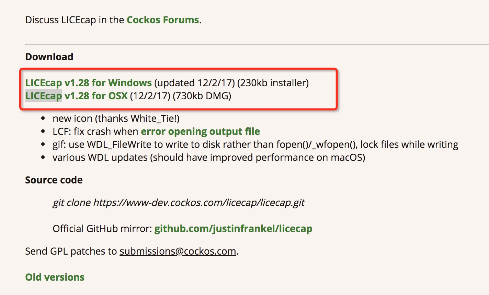
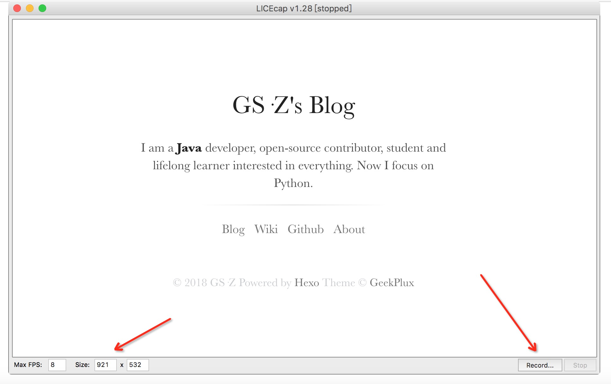
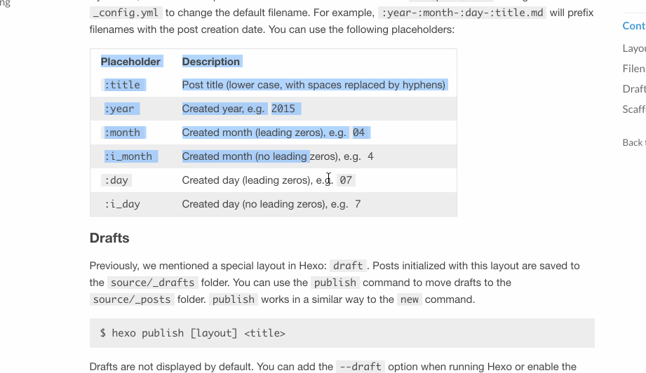

最近发现一个比较好用的gif录制软件，支持mac和windows，而且还是免费的，地址：[https://www.cockos.com/licecap/](https://www.cockos.com/licecap/)
## 安装方法

如上图，下载相应系统的安装包，另外mac下可以使用homebrew命令来安装,非常方便

	brew cask install LICEcap
	
## 使用方法

左边可以调节截屏框大小，右边是开始、暂停和结束按钮，结束后保存在本地，mac下右击使用浏览器打开，preview不能打开gif文件

## 效果展示

